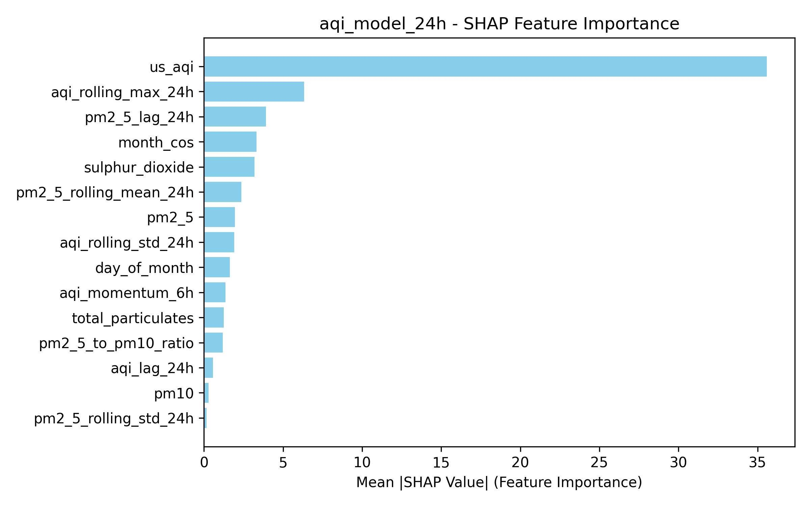

# Pearls AQI Predictor


**Serverless Air Quality Forecasting System for Lahore, Pakistan**

## Overview

**Pearls AQI Predictor** is a production-grade air quality forecasting system providing 24h, 48h, and 72h AQI predictions. Built with 100% serverless architecture, it automates data ingestion, model training, and delivers real-time forecasts through an interactive dashboard.


[](https://www.python.org/)
[](https://streamlit.io/)
[](https://www.tensorflow.org/)
[](https://scikit-learn.org/)
[](https://www.hopsworks.ai/)


### Table of Contents

- [Key Highlights](#key-highlights)
- [Key Features](#-key-features)
- [System Architecture](#-system-architecture)
- [Installation](#-installation)
- [Quick Start](#-quick-start)
- [Project Structure](#-project-structure)
- [Model Performance](#-model-performance)
- [Feature Engineering](#-feature-engineering)
- [Dashboard](#-dashboard)
- [CI/CD Automation](#-cicd-automation)


### Key Highlights

- **Multi-Horizon Forecasting**: 24h, 48h, 72h predictions with 87%+ accuracy
- **Automated MLOps**: Hourly data ingestion, daily model retraining via GitHub Actions
- **Feature Store**: Hopsworks integration with 60+ engineered features
- **Best-in-Class Models**: Random Forest outperforms Neural Networks by 30%+
- **Explainable AI**: SHAP analysis for model interpretability
- **Real-Time Dashboard**: Streamlit-based interactive visualization

##  Key Features

- **Automated Pipeline**: Hourly data ingestion, daily model retraining
- **Ensemble Learning**: Random Forest, Ridge Regression, Neural Networks
- **SHAP Analysis**: Interpretable feature importance
- **Live Dashboard**: Real-time AQI + 3-day forecasts
- **Serverless**: Zero infrastructure management


## System Architecture

```
┌───────────────────────────────────────────────────────────────────┐
│                        Open-Meteo API                             │
│            (Hourly Air Quality & Weather Data)                    │
└─────────────────────────┬─────────────────────────────────────────┘
                          │
                          ▼
┌───────────────────────────────────────────────────────────────────┐
│                   Feature Pipeline (Hourly)                       │
│  ┌─────────────────────────────────────────────────────────────┐  │
│  │  Data Ingestion → Feature Engineering → Validation          │  │
│  │  • Time-based features  • Lag features  • Rolling stats     │  │
│  └─────────────────────────────────────────────────────────────┘  │
└─────────────────────────┬─────────────────────────────────────────┘
                          │
                          ▼
┌───────────────────────────────────────────────────────────────────┐
│                 Hopsworks Feature Store                           │
│            (Versioned Time-Series Feature Groups)                 │
│  • aqi_features_v1: 60+ engineered features                       │
│  • Event time indexing for temporal queries                       │
└──────────────┬────────────────────────────────────┬───────────────┘
               │                                    │
               ▼                                    ▼
┌──────────────────────────────┐    ┌─────────────────────────────┐
│   Training Pipeline (Daily)  │    │  Inference Pipeline(Hourly) │
│  ┌────────────────────────┐  │    │  ┌────────────────────────┐ │
│  │ • Fetch training data  │  │    │  │ • Load best models     │ │
│  │ • Feature selection    │  │    │  │ • Engineer features    │ │
│  │ • Train 3 models       │  │    │  │ • Generate forecasts   │ │
│  │ • Model evaluation     │  │    │  │ • Health alerts        │ │
│  │ • Select best model    │  │    │  └────────────────────────┘ │
│  └────────────────────────┘  │    └─────────────┬───────────────┘
└──────────────┬───────────────┘                  │
               │                                  │
               ▼                                  │
┌──────────────────────────────┐                  │
│     Best Models Saved        │                  │
│  • aqi_model_24h             │                  │
│  • aqi_model_48h             │                  │
│  • aqi_model_72h             │                  │
│  (Best models with metadata) │                  │
└──────────────────────────────┘                  │
                                                  ▼
                                 ┌───────────────────────────────┐
                                 │   Streamlit Dashboard         │
                                 │  ┌──────────────────────────┐ │
                                 │  │ • Live AQI Monitoring    │ │
                                 │  │ • 3-Day Forecasts        │ │
                                 │  │ • Historical Trends      │ │
                                 │  │ • SHAP Analysis          │ │
                                 │  │ • Health Alerts          │ │
                                 │  └──────────────────────────┘ │
                                 └───────────────────────────────┘
```


## Installation

### Prerequisites
- Python 3.8+
- Hopsworks account ([free tier](https://www.hopsworks.ai/))

### Setup

```bash
# Clone repository
git clone https://github.com/Ubaid-Raza-AI/10-pearls-aqi-predictor.git
cd pearls-aqi-predictor

# Install dependencies
pip install -r requirements.txt

# Configure environment (.env file)
HOPSWORKS_API_KEY=your_api_key
HOPSWORKS_PROJECT_NAME=your_project
LATITUDE=31.558
LONGITUDE=74.3507
```

## Quick Start

```bash
# 1. Backfill historical data
python feature_pipeline.py --mode historical

# 2. Train models
python train_model.py

# 3. Generate SHAP analysis
python shap_analysis.py

# 4. Run inference
python inference_pipeline.py

# 5. Launch dashboard
streamlit run app.py
```

## Project Structure

```
10-pearls-aqi-predictor/
├── 📄 app.py                      # Streamlit dashboard
├── 📄 feature_pipeline.py         # Data ingestion & feature engineering
├── 📄 train_model.py              # Model training
├── 📄 inference_pipeline.py       # Prediction generation
├── 📄 shap_analysis.py            # Feature importance analysis
├── 📄 requirements.txt            # Dependencies
├── 📄 .env                        # Environment variables
│
├── 📂 aqi_model_24h/              # 24h model artifacts
├── 📂 aqi_model_48h/              # 48h model artifacts
├── 📂 aqi_model_72h/              # 72h model artifacts
│
├── 📂 images/                     # SHAP visualizations
└── 📂 csv_files/                  # Analysis outputs
```


## Model Performance

### Overview: Multi-Horizon Predictions

The system employs three specialized models, each optimized for a specific prediction horizon. Each model is independently trained and evaluated to provide the most accurate forecasts.

| Horizon | Best Model | RMSE | MAE | R² Score | Training Samples |
|---------|-----------|------|-----|----------|------------------|
| **24h** | Random Forest | 14.49 | 8.68 | 0.873 | 19,948 |
| **48h** | Random Forest | 15.73 | 8.08 | 0.850 | 19,900 |
| **72h** | Random Forest | 13.26 | 6.45 | 0.893 | 19,852 |


## Detailed Model Analysis: 24-Hour Prediction

### Model Selection & Training

The 24-hour model underwent rigorous training and evaluation using three different algorithms. Here's the complete comparison:

#### Model Comparison Results

| Model Type | RMSE | MAE | R² Score | Status |
|------------|------|-----|----------|--------|
| **Random Forest** ⭐ | **14.4910** | **8.6766** | **0.8730** | ✅ **Selected** |
| Neural Network | 20.5815 | 14.8379 | 0.7437 | ❌ Not selected |
| Ridge Regression | 22.5875 | 16.2259 | 0.6913 | ❌ Not selected |

**Why Random Forest Won:**
- **29.6% better RMSE** than Neural Network
- **41.4% better MAE** than Neural Network  
- **35.9% better RMSE** than Ridge Regression
- Most stable performance across all AQI ranges
- Best R² score indicating strongest predictive power

### Training Configuration

```python
RandomForestRegressor(
    n_estimators=200,      # 200 decision trees
    max_depth=20,          # Maximum tree depth
    random_state=42,       # Reproducibility
    n_jobs=-1             # Use all CPU cores
)
```

**Training Details:**
- **Training samples:** 19,948 (80% of data)
- **Test samples:** 4,988 (20% of data)
- **Total features engineered:** 67
- **Features selected for model:** Top 15
- **Feature selection method:** Random Forest importance ranking
- **Scaling:** StandardScaler applied to all features
- **Training time:** ~45 seconds on standard CPU

###  15 Features (by Importance Score)

The model uses carefully selected features based on their contribution to prediction accuracy:

| Rank | Feature Name | Importance | Description |
|------|-------------|------------|-------------|
| **1** | `us_aqi` | **0.5264** | **Current AQI value** (52.64% of total importance) |
| 2 | `pm2_5_rolling_mean_24h` | 0.0869 | 24-hour rolling average of PM2.5 |
| 3 | `pm2_5` | 0.0390 | Current PM2.5 concentration |
| 4 | `total_particulates` | 0.0300 | Combined PM2.5 + PM10 load |
| 5 | `pm2_5_rolling_std_24h` | 0.0191 | 24-hour PM2.5 volatility |
| 6 | `day_of_month` | 0.0154 | Day of the month (1-31) |
| 7 | `pm2_5_lag_24h` | 0.0132 | PM2.5 value from 24 hours ago |
| 8 | `pm10` | 0.0099 | Current PM10 concentration |
| 9 | `sulphur_dioxide` | 0.0095 | SO₂ levels |
| 10 | `aqi_lag_24h` | 0.0094 | AQI value from 24 hours ago |
| 11 | `aqi_momentum_6h` | 0.0092 | 6-hour AQI change rate |
| 12 | `pm2_5_to_pm10_ratio` | 0.0087 | Ratio of fine to coarse particles |
| 13 | `aqi_rolling_std_24h` | 0.0077 | 24-hour AQI volatility |
| 14 | `aqi_rolling_max_24h` | 0.0075 | Maximum AQI in last 24 hours |
| 15 | `month_cos` | 0.0073 | Cosine-encoded month (seasonal patterns) |

### SHAP Feature Importance Analysis

SHAP (SHapley Additive exPlanations) analysis reveals how each feature contributes to individual predictions:

<div align="center">



*SHAP Bar Plot: Mean absolute SHAP values showing feature impact on predictions*

</div>

**Key Insights from Top Features:**

1. **Current AQI Dominates (52.64%)**: The most recent AQI reading is by far the strongest predictor, indicating strong temporal autocorrelation in air quality patterns.

2. **PM2.5 is Critical (Combined ~13%)**: Multiple PM2.5-related features (current, rolling mean, rolling std, lag) appear in top ranks, confirming it as the primary pollutant affecting AQI in Lahore.

3. **Rolling Statistics Matter (Combined ~8%)**: 24-hour rolling means and standard deviations capture important trend and volatility patterns that help predict near-future AQI.

4. **Temporal Context (Combined ~3%)**: Day-of-month and seasonal (month_cos) features help capture recurring weekly and monthly patterns.

5. **Lag Features (Combined ~2%)**: Historical values from 24 hours ago provide crucial context for understanding trend directions.


### Model Artifacts

24h model artifacts are saved in `aqi_model_24h/` directory:

```
aqi_model_24h/
├── model.pkl          # Serialized Random Forest model
├── scaler.pkl         # StandardScaler for feature normalization
└── metadata.json      # Complete model information & metrics
```


## 48-Hour & 72-Hour Prediction Models

The **48-hour** and **72-hour** prediction models follow the **same training methodology** as the 24-hour model:

### Training Process
1. ✅ Three algorithms compared: Random Forest, Neural Network, Ridge Regression
2. ✅ Top 15 features selected using Random Forest importance
3. ✅ StandardScaler applied for feature normalization
4. ✅ Best model selected based on RMSE performance
5. ✅ SHAP analysis performed for interpretability
6. ✅ Models saved with complete metadata


**Key Observations:**
- Random Forest consistently outperforms other algorithms across all horizons
- Prediction accuracy decreases slightly with longer time horizons (expected behavior)
- Current AQI remains the most important feature, though its relative importance decreases for longer predictions
- All models maintain R² > 0.81, indicating strong predictive power

**Complete SHAP analysis and feature importance rankings for all models are available in:**
- `images/aqi_model_24h_shap_bar.png`
- `images/aqi_model_48h_shap_bar.png`
- `images/aqi_model_72h_shap_bar.png`

**Detailed feature importance CSVs:**
- `csv_files/aqi_model_24h_shap_values.csv`
- `csv_files/aqi_model_48h_shap_values.csv`
- `csv_files/aqi_model_72h_shap_values.csv`

---

## Feature Engineering

### Raw Data (Open-Meteo API)
PM10, PM2.5, CO, SO₂, NO₂, O₃, US AQI

### Engineered Features

| Category | Features | 
|----------|----------|
| **Time-Based** | hour_sin, hour_cos, month_sin, month_cos, is_weekend, season
| **Lag Features** | aqi_lag_1h to 24h, pm2_5_lag_1h to 24h
| **Rolling Stats** | aqi_rolling_mean/std/min/max (3h, 6h, 12h, 24h)
| **Derived** | aqi_change_rate, pm2_5_to_pm10_ratio, total_particulates
| **Interaction** | pm2_5_x_hour, aqi_x_weekend
| **Statistical** | aqi_ema_12h/24h, aqi_momentum_6h/24h

**Top 15 features selected** per model using Random Forest importance ranking.


## Dashboard

### Features
- **Current AQI**: Live readings with color-coded health categories
- **Pollutant Levels**: Bar chart showing PM2.5, PM10, NO₂, O₃, SO₂
- **3-Day Forecast**: Predictions for 24h, 48h, 72h with delta indicators
- **Historical Trends**: 4-day smoothed AQI visualization
- **SHAP Analysis**: Feature importance plots for all models
- **Health Alerts**: Automatic warnings for AQI > 150


## CI/CD Automation

### GitHub Actions Workflows

**Feature Pipeline** (Hourly)
- Cron: `0 1 * * *`
- Fetches last 5 days of data
- Engineers and stores features

**Training Pipeline** (Daily)  
- Cron: `0 2 * * *`
- Retrains all three models
- Updates model registry

### Setup
1. Go to **Settings** → **Secrets** → **Actions**
2. Add `HOPSWORKS_API_KEY`
3. Workflows run automatically


## Contributing

Contributions welcome! Please:

1. Fork the repository
2. Create feature branch (`git checkout -b feature/AmazingFeature`)
3. Commit changes (`git commit -m 'Add AmazingFeature'`)
4. Push to branch (`git push origin feature/AmazingFeature`)
5. Open Pull Request


## License

This project is licensed under the MIT License.


## Acknowledgments

- **Open-Meteo** for free air quality API
- **Hopsworks** for feature store platform
- **Streamlit** for dashboard framework


<div align="center">

**Star this repo if you find it helpful!**

</div>